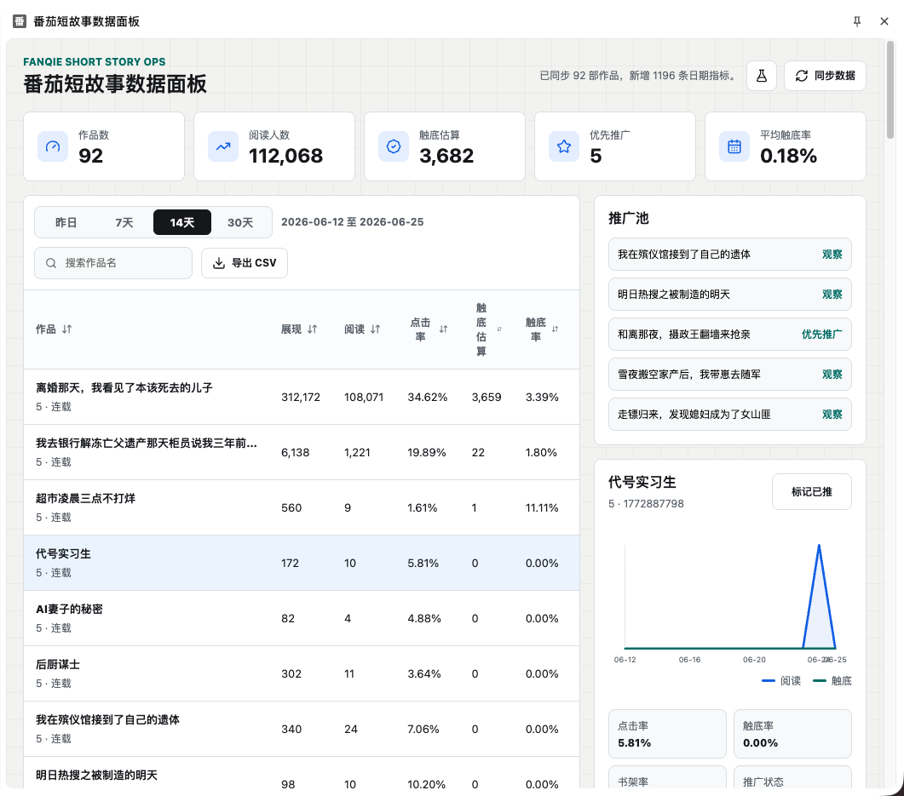
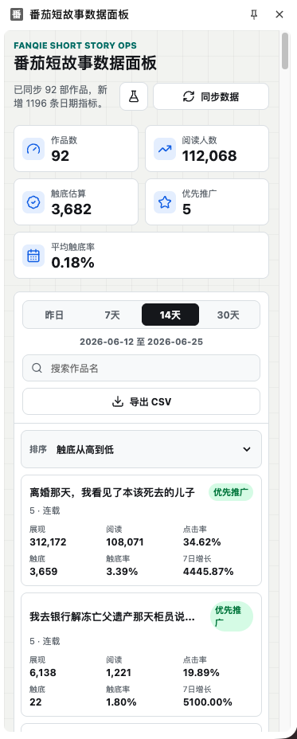

# 番茄短故事数据增强面板

> 一个 Chrome 浏览器插件，用于可视化展示番茄小说作者的短故事作品数据，辅助精准运营和推广决策。

## 界面预览

### 大屏桌面端



### 小屏响应式



## 功能特性

- **作品数据聚合**：统一展示所有短故事的曝光、点击、阅读、触底等核心指标
- **智能排序筛选**：支持按任意字段排序，快速定位高潜力作品
- **爆款推荐池**：自动评分标记优先推广作品
- **趋势可视化**：单篇作品近 14 日阅读和触底趋势图
- **推广状态管理**：标记已推广/未推广，避免重复投放
- **数据导出**：一键导出 CSV 表格

## 技术栈

- **框架**：React 18 + TypeScript
- **构建**：Vite 6
- **表格**：TanStack React Table
- **图标**：Lucide React
- **日期**：Day.js
- **本地存储**：Dexie (IndexedDB)
- **包管理**：pnpm

## 快速开始

### 安装依赖

```bash
pnpm install
```

### 开发模式

```bash
pnpm dev
```

开发服务器运行在 `http://127.0.0.1:5173`。

### 构建生产版本

```bash
pnpm build
```

构建产物输出到 `dist/` 目录。

### 加载 Chrome 插件

1. 打开 Chrome 浏览器，访问 `chrome://extensions/`
2. 开启「开发者模式」
3. 点击「加载已解压的扩展程序」
4. 选择项目的 `dist/` 目录

## 项目结构

```
FanQieNovelPanel/
├── src/
│   ├── background/       # Chrome 扩展 Background Service Worker
│   │   └── index.ts
│   ├── client/           # 番茄官方 API 客户端
│   │   └── fanqieApi.ts
│   ├── db/               # IndexedDB 数据库 (Dexie)
│   │   ├── schema.ts
│   │   └── index.ts
│   ├── domain/           # 业务逻辑（指标计算、评分）
│   │   └── metrics.ts
│   ├── shared/           # 共享类型和常量
│   │   ├── types.ts
│   │   └── constants.ts
│   ├── sync/             # 数据同步与标准化
│   │   ├── fanqieSync.ts
│   │   └── normalize.ts
│   └── ui/               # React 前端界面
│       ├── main.tsx
│       ├── pages/
│       │   └── App.tsx
│       └── styles.css
├── assets/               # 展示截图
├── docs/                 # 项目文档
├── public/               # 静态资源（manifest.json、图标）
├── index.html
├── package.json
├── tsconfig.json
└── vite.config.ts
```

## 数据模型

### works 表

| 字段 | 说明 |
|------|------|
| platformWorkId | 平台作品 ID |
| title | 作品标题 |
| status | 状态（publishing/finished） |
| publishTime | 发布时间 |

### workDailyStats 表

| 字段 | 说明 |
|------|------|
| platformWorkId | 平台作品 ID |
| statDate | 数据日期 |
| impressions | 展现量 |
| clicks | 点击量 |
| readers | 阅读人数 |
| finishedReaders | 触底读完人数 |

### promotionMarks 表

| 字段 | 说明 |
|------|------|
| platformWorkId | 平台作品 ID |
| state | 推广状态（promoted/unpromoted/watch） |
| promotedAt | 推广时间 |
| channel | 推广渠道 |

## 核心指标

| 指标 | 公式 |
|------|------|
| 点击率 | clicks / impressions |
| 触底率 | finishedReaders / readers |
| 7日增长率 | 近7日读完人数 / 前7日读完人数 - 1 |

### 爆款评分规则

- 曝光量高于均值 +1
- 点击率高于均值 +1
- 触底率高于均值 +2
- 近7日增长为正 +1
- 尚未推广 +1

总分 ≥ 4 为「优先推广」，3 为「观察」。

## 使用说明

1. 在 Chrome 中登录番茄作家后台（https://fanqienovel.com）
2. 打开本插件 Side Panel
3. 点击「同步番茄数据」按钮拉取最新数据
4. 在表格中浏览、排序、筛选作品
5. 点击「标记已推」管理推广状态
6. 点击「导出 CSV」保存数据

## 开发说明

- 无测试框架
- 无代码格式化工具
- 构建时自动进行 TypeScript 类型检查

## TODO

### 当前待修复

- [ ] `singleByDate` 接口日期参数已修复（ISO 字符串），待用户同步验收
- [ ] 触底估算（finishedReaders）数据显示为 0，待 API 返回字段确认
- [ ] 日期范围筛选（昨天/7天/14天/30天）切换无效果，与累计数据存储日期有关

### 功能迭代（V2）

- [ ] **短故事发布微头条**：从面板选择作品 → 编辑推广文案 → 一键发布到微头条
  - [ ] 调研微头条发布接口（POST）路径与鉴权方式
  - [ ] 实现推广文案模板系统（变量自动填充）
  - [ ] 实现发布 UI（选择作品 → 编辑文案 → 预览 → 发布）
  - [ ] 实现发布历史记录与状态追踪
  - [ ] 发布成功后自动更新推广标记

- [ ] **短故事上传**：在面板内直接创建和发布短故事
  - [ ] 调研短故事创建/发布接口
  - [ ] 实现单篇短故事编辑器（标题 + 正文 + 标签）
  - [ ] 实现封面选择功能（自动生成 / 手动上传）
  - [ ] 实现草稿保存（本地 + 云端）
  - [ ] 实现提交审核 + 审核状态追踪
  - [ ] 批量上传功能（可选）

- [ ] **小说章节批量上传**：批量导入章节草稿并提交审核
  - [ ] 调研章节创建/批量提交接口
  - [ ] 实现文件解析模块（TXT / DOCX / Markdown）
  - [ ] 实现章节管理 UI（列表 + 拖拽排序 + 编辑）
  - [ ] 实现章节内容预览与编辑器
  - [ ] 实现批量提交审核 + 进度追踪
  - [ ] 实现审核状态追踪与失败重试

### 功能迭代（V3）

- [ ] 自动化推广排期（定时发布微头条）
- [ ] 多账号管理
- [ ] 数据看板定制（自定义指标组合）
- [ ] 团队协作（推广标记同步）
- [ ] AI 辅助生成推广文案

### 基础设施

- [ ] 添加 ESLint + Prettier 代码规范
- [ ] 补充核心指标计算的单元测试
- [ ] 实现本地数据备份与导入（JSON 导出/恢复）
- [ ] 实现自动同步开关（定时拉取）
- [ ] 同步失败自动重试机制
- [ ] 官方字段变化告警（保留 raw 响应便于排查）
- [ ] 未登录 / 空数据 / 同步中等状态页面优化

## 合规声明

- 仅读取当前登录作者自己的作品数据
- 不篡改平台数据
- 不爬取他人信息
- 所有数据存储在本地 IndexedDB

## License

MIT
