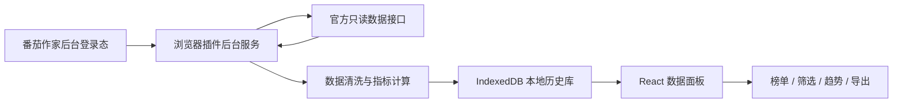

# 番茄短故事数据增强面板｜项目实施方案

## 1. 实施目标

本项目建议定位为一个本地优先的数据增强工具：复用用户在番茄作家后台的官方登录态，只读取当前作者自己的作品数据，在本地完成聚合、计算、展示和导出。

核心目标不是替代官方后台，而是把分散在后台里的短故事数据整理成一个可排序、可筛选、可复盘的运营面板。

## 2. 推荐技术选型

### 2.1 总体方案：浏览器插件优先

推荐采用 Chrome / Edge 浏览器插件形态，原因如下：

- 可以天然复用官方站点登录态，不需要自建账号系统。
- 不需要额外部署后端，启动成本低。
- 用户数据可以只保存在本机，隐私和合规边界更清楚。
- 插件可以通过 Host Permission 访问指定官方域名，适合做只读数据增强。
- 后续如果需要自动同步，可以使用浏览器插件的 alarms 能力做定时任务。

### 2.2 前端技术

- 框架：React + TypeScript
- 构建：Vite
- 插件框架：WXT 或 Plasmo
- UI：shadcn/ui + Tailwind CSS
- 表格：TanStack Table
- 图表：ECharts
- 本地数据库：IndexedDB，封装库使用 Dexie
- 导出：PapaParse 或 SheetJS
- 日期处理：dayjs

这套组合足够轻量，生态成熟，开发效率高，也方便后续扩展为独立 Web 面板。

### 2.3 暂不建议的技术

- 暂不引入独立后端：MVP 阶段没有多人协作、云端同步、复杂权限需求。
- 暂不引入大型状态管理：优先使用 React Query + 本地 hooks，避免 Redux 级别复杂度。
- 暂不引入 Electron：浏览器插件已经能覆盖登录态复用和本地展示，桌面壳会增加包体和维护成本。
- 暂不引入服务端数据库：历史数据先放 IndexedDB，够用且隐私边界简单。

## 3. 系统架构



### 3.1 插件模块划分

- Background Service Worker：负责定时同步、请求官方接口、写入本地库。
- Side Panel / Extension Page：负责展示数据面板。
- Content Script：仅在必要时辅助读取页面上下文，不做页面篡改。
- Storage Layer：使用 Dexie 封装 IndexedDB，存作品、每日指标和推广标记。
- Calculation Layer：计算点击率、阅读率、触底率、增长率、爆款评分。

## 4. 数据模型设计

### 4.1 作品表 `works`

| 字段 | 说明 |
| --- | --- |
| id | 本地主键 |
| platformWorkId | 官方作品 ID |
| title | 作品名 |
| publishTime | 发布时间 |
| status | 连载 / 完结 |
| createdAt | 首次同步时间 |
| updatedAt | 最近同步时间 |

### 4.2 作品每日数据表 `work_daily_stats`

| 字段 | 说明 |
| --- | --- |
| id | 本地主键 |
| platformWorkId | 官方作品 ID |
| statDate | 数据日期 |
| impressions | 曝光量 |
| clicks | 点击量 |
| readers | 阅读人数 |
| retention15s | 15s 留存人数 |
| retention30s | 30s 留存人数 |
| retention60s | 60s 留存人数 |
| finishedReaders | 触底读完人数 |
| internalTraffic | 站内流量 |
| externalTraffic | 微头条等站外流量 |
| raw | 原始响应快照，便于排查字段变化 |

### 4.3 运营标记表 `promotion_marks`

| 字段 | 说明 |
| --- | --- |
| platformWorkId | 官方作品 ID |
| promoted | 是否已推广 |
| promotedAt | 推广时间 |
| channel | 推广渠道 |
| note | 复盘备注 |

## 5. 核心指标规则

MVP 阶段建议先使用透明、可解释的规则，不急着做复杂算法。

| 指标 | 公式 |
| --- | --- |
| 点击率 | clicks / impressions |
| 阅读转化率 | readers / clicks |
| 15s 留存率 | retention15s / readers |
| 30s 留存率 | retention30s / readers |
| 60s 留存率 | retention60s / readers |
| 触底率 | finishedReaders / readers |
| 站外占比 | externalTraffic / readers |
| 近 7 日增长率 | 近 7 日读完人数 / 前 7 日读完人数 - 1 |

### 5.1 爆款潜力标记

建议先采用规则评分：

- 曝光量高于账号作品均值，+1
- 点击率高于账号均值，+1
- 触底率高于账号均值，+2
- 近 7 日增长率为正，+1
- 尚未推广，+1

总分达到 4 分以上，标记为「优先推广」；3 分标记为「观察」。

## 6. 功能分期

### 6.1 第一期：MVP，可用闭环

目标：先让用户能批量看清所有短故事表现。

- 插件初始化与权限申请
- 检测用户是否已登录番茄作家后台
- 拉取作品列表
- 拉取单篇作品核心数据
- 本地保存历史快照
- 作品总榜表格
- 字段排序和关键词搜索
- 时间范围筛选：昨日、7 天、30 天
- CSV / XLSX 导出

交付标准：用户打开插件后，可以看到全部作品榜单，并能按点击、阅读、触底人数排序。

### 6.2 第二期：运营增强

目标：从“看数据”升级为“辅助决策”。

- 爆款潜力评分
- 优先推广作品池
- 已推广 / 未推广标记
- 单篇作品趋势图
- 站内 / 站外流量对比
- 作品备注和复盘记录

交付标准：用户可以快速筛选适合微头条推广的作品，并记录推广状态。

### 6.3 第三期：稳定性与体验

目标：减少维护成本，让工具更稳。

- 自动同步开关
- 同步失败重试
- 字段变化告警
- 数据备份与导入
- 本地数据清理
- 轻量设置页

交付标准：即使官方字段有小幅变化，也能提示用户并保留历史数据。

## 7. 开发步骤

### 7.1 数据源确认

先在用户正常登录番茄作家后台的情况下，通过浏览器 DevTools 观察官方页面的网络请求，确认：

- 作品列表接口
- 单篇作品数据接口
- 时间范围参数
- 分页参数
- 必要请求头和 CSRF 字段
- 返回字段和数据口径

原则：只复用用户自己的登录态，只请求官方后台正常页面已经使用的数据接口，不绕过权限、不破解、不做高频请求。

### 7.2 插件骨架

- 初始化 WXT / Vite / React / TypeScript 项目
- 配置 manifest host permissions
- 搭建 Side Panel 页面
- 搭建 Background Service Worker
- 封装官方请求客户端
- 封装 Dexie 数据库

### 7.3 数据同步

- 同步作品列表
- 按作品分页同步指标
- 保存原始响应和标准化字段
- 记录同步时间和失败原因
- 控制请求频率，避免对官方服务造成压力

### 7.4 数据展示

- 总览指标：作品数、总阅读、总触底、平均触底率
- 作品榜单：支持排序、搜索、筛选
- 趋势图：展示单篇作品近 7 / 30 日变化
- 推荐池：按规则评分展示优先推广作品
- 导出：按当前筛选条件导出表格

### 7.5 测试验收

- 未登录状态提示
- 登录后首次同步
- 多页作品同步
- 网络失败重试
- 空数据展示
- 字段缺失兼容
- 导出文件可打开
- 历史数据不丢失

## 8. 项目目录建议

```text
src/
  background/
    index.ts
    sync.ts
  client/
    fanqieApi.ts
    request.ts
  db/
    index.ts
    schema.ts
  domain/
    metrics.ts
    scoring.ts
    normalize.ts
  ui/
    pages/
      Dashboard.tsx
      WorkDetail.tsx
      Settings.tsx
    components/
      WorkTable.tsx
      MetricCards.tsx
      TrendChart.tsx
      PromotionPool.tsx
  shared/
    types.ts
    constants.ts
```

## 9. 主要风险与应对

| 风险 | 应对 |
| --- | --- |
| 官方接口字段变化 | 保存 raw 响应，标准化层集中适配 |
| 登录态过期 | 面板提示用户回官方后台重新登录 |
| CORS 或 Cookie 限制 | 优先使用浏览器插件权限请求；仍受限时再评估本地轻量服务 |
| 请求过频 | 设置并发限制、间隔同步、手动刷新入口 |
| 数据口径不明确 | 在 UI 中标明统计周期和最后同步时间 |
| 合规风险 | 只读、用户主动安装、限定域名、不过权、不采集他人数据 |

## 10. 轻量落地结论

推荐路线：

1. 先做浏览器插件，不做独立后端。
2. 数据只存在本地 IndexedDB，不做云端同步。
3. 用 React + TypeScript + Vite + Dexie + TanStack Table + ECharts 完成 MVP。
4. 第一阶段只做作品榜单、排序、筛选、导出和基础指标。
5. 第二阶段再做推广标记、趋势图和爆款推荐池。

这条路线实现成本最低，最符合“复用官方登录态、只读、轻量、可落地”的项目定位。
